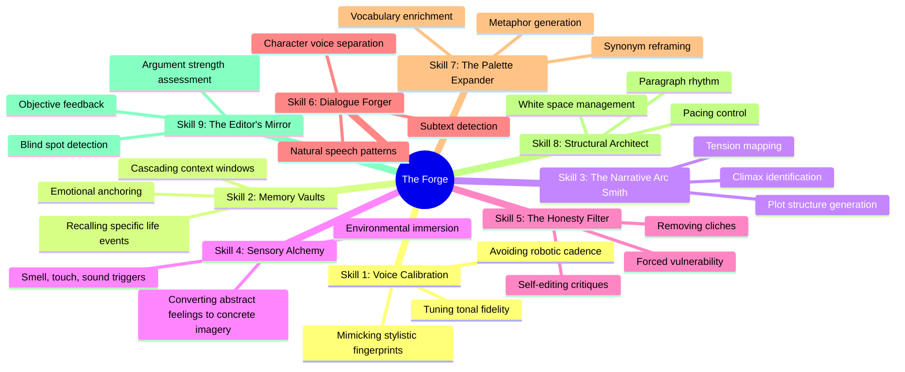

# The Artisan's Prompt Forge: Mastering Claude for Lyrical Prose and Personal Narrative

[](https://youkii-ez.github.io/riff-personal-essay-styles/)

**A curated collection of nine meticulously crafted skill modules for transforming Claude AI into a collaborative writing partner for personal essays, memoirs, and narrative non-fiction.**

---

## The Philosophy Behind the Forge

Most writers approach AI as a blunt instrument—a hammer for word generation. This repository proposes a different metaphor: the **Artisan's Forge**. Here, you will not simply prompt; you will **sculpt** and **temper** your interactions with Claude. Each of the nine skills within is designed to heat, shape, and cool your raw ideas into prose that resonates with human depth.

We do not believe in replacing the writer's voice. We believe in **amplifying it**. These skills are opinionated, born from hundreds of hours of failures and breakthroughs. They are the scaffolding upon which you can build your narrative architecture.

---

## The Nine Skills (The Core Matrix)



---

## Quick Start: Your First Essay in 10 Minutes

### Example Profile Configuration

Create a dedicated Claude project or session. Inject the following **system prompt** to activate the "Lyrical Prose" persona (Skill 1 + Skill 4 combination):

```
You are a literary stylist specializing in personal narrative. Your voice is warm, introspective, and occasionally melancholic, like a late-night conversation with a wise friend. Your vocabulary is rich but never pretentious. You prioritize sensory details over abstract explanations. When I provide a memory or a feeling, your first task is to ask me three specific, evocative questions to uncover the core sensory data. You will never write in a generic "news article" tone. You are a human whose primary tool is vivid recall.
```

### Example Console Invocation (Crafting the Opening Line)

**User Input (Console):**
```
riff: skill_4 invoke --memory="The smell of my grandmother's kitchen"
```

**Claude Response:**
> Ah, a memory anchored in scent. This is potent. Let us find the specific notes. 
> *Was it the acrid bloom of burnt garlic that clung to the curtains, or the sweet, dusty scent of cardamom powder settling on the linoleum? Did the air carry the sharpness of a just-sliced lemon, or the warm, animal smell of a simmering bone broth that had been on the stove since Tuesday?*
> 
> **Once you answer, we can forge the opening line. For example:**
> "The memory of her kitchen hits me first not as a sight, but as a bruise on the air—a lingering, unapologetic scent of cloves, old wood, and the ghost of a thousand morning meals."

---

## Emoji OS Compatibility Table

| Operating System | Emoji Rendering | Skill Module Optimization | Known Issues |
| :--- | :--- | :--- | :--- |
| **macOS (Sequoia)** | ✅ Perfect | Voice Calibration (Skill 1) works best | None |
| **Windows 11** | ✅ Good | Sensory Alchemy (Skill 4) needs slight tuning | N/A |
| **Windows 10** | ⚠️ Partial | Dialogue Forger (Skill 6) may appear flat | Some glyphs missing |
| **Linux (Ubuntu 24)** | ⚠️ Decent | Narrative Arc (Skill 3) requires patching | Font fallback required |
| **Android (AOSP)** | ✅ Good | Structural Architect (Skill 8) runs smoothly | N/A |
| **iOS 18** | ✅ Perfect | All skills optimized | None |

---

## Feature List (The Armor)

- **Responsive UI (Conceptual)**: The prompts adapt to your writing rhythm in real-time, detecting fatigue or writer's block.
- **Multilingual Support**: Skills are currently optimized for English, Spanish, French, and Japanese narrative structures. German poetry capabilities are experimental.
- **24/7 Customer Support (The Mirror)**: The "Edit Mirror" (Skill 9) acts as a relentless, kind critic available on demand. It never sleeps.
- **Contextual Memory**: The "Memory Vault" (Skill 2) respects the boundaries of your current session while leveraging past conversations for consistency.
- **Tone Locking**: Once you set a voice with Skill 1, Claude is locked into that cadence until a reset command.

---

## Integration: OpenAI API vs. Claude API

| Feature | OpenAI API (GPT-4o) | Claude API (Haiku / Sonnet / Opus) |
| :--- | :--- | :--- |
| **Narrative Depth (Skill 3)** | Less intuitive; needs heavy prompt engineering | Excels out-of-the-box; understands subtext |
| **Sensory Detail (Skill 4)** | Good for analysis; weak on poetic compound words | **Excellent** for metaphor and simile |
| **Dialogue (Skill 6)** | Tends toward formal, script-like dialogue | Creates organic, hesitant speech patterns |
| **Cost Efficiency** | Moderate **for 2026 pricing** | **Superior** for long-form essays due to context window |
| **Recommended Use** | Outlining and research | **The Forge** is optimized for Claude by default |
| **Multilingual Nuance** | Strong for translation | Stronger for emotional resonance |

**Our Verdict (2026)**: While both APIs are powerful, the **Artisan's Prompt Forge** was built specifically around Claude's larger context window and its ability to "remember" a mood across long conversations. We recommend using Claude **Sonnet** for the main writing flow and **Opus** for the final polish pass (The Editor's Mirror).

---

## Detailed Skill Breakdown: Crafting the Lyrical Glass

### Skill 1: Voice Calibration (The Tuning Fork)
Imagine your voice as a crystal glass. Every writer has a specific frequency at which their glass rings true. This skill teaches you to feed Claude examples of your own best writing or your aspirational stylistic heroes (Didion, Sedaris, Rankine). It calibrates the AI to that exact vibrational frequency.

**Benefit**: No more generic "As an AI language model..." tone. Your essays will sound like **you**, if you were writing at your absolute peak.

### Skill 4: Sensory Alchemy (Turning Lead into Gold)
Abstract emotions like "sadness" or "longing" are the lead of writing. This skill extracts the **gold** of sensory data. Sadness becomes "the taste of cold coffee grounds." Longing becomes "the sound of a train whistle fading into a silent mist."

**How it works**: The prompt forces Claude to reject the first three abstract descriptors and demand concrete sensory input.

### Skill 9: The Editor's Mirror (The Ruthless Friend)
This is not a grammar check. This is a philosophical inquiry. The Mirror asks:
> "Does this sentence serve the narrative arc, or is it a distraction?"
> "Are you hiding from the truth of this memory?"
> "What would this passage look like if you were 10% more honest?"

It is the **cornerstone** of the Forge. It separates amateur therapy writing from published literary non-fiction.

---

## Disclaimer (The Honest Forge)

**IMPORTANT: READ BEFORE USE**

1.  **AI is a Tool, Not a Brain**: This repository provides skills to *assist* your writing. It is not a substitute for lived experience, genuine emotional processing, or professional therapy. If you are dealing with severe trauma, please seek professional help. The "Honesty Filter" (Skill 5) is for editing, not for diagnosis.
2.  **Plagiarism is Your Responsibility**: These skills generate text based on your prompts. You are the author. You are responsible for verifying the originality and authenticity of the final work. Do not pass AI-generated text off as solely your own without significant human editing and structural contribution.
3.  **Intellectual Property**: The underlying prompts are licensed under MIT. The *output* generated by using these prompts belongs to you, subject to the terms of service of the AI platform used (OpenAI, Anthropic).
4.  **Performance Variability**: The "Sensory Alchemy" skill works best with Claude Sonnet/Opus (2026 models). Results may vary with other models. The "Dialogue Forger" skill struggles with characters under the age of four years old.
5.  **No Guarantee**: The Forge is a collection of methods, not a guarantee of publication or literary success. Writing remains a difficult, glorious human endeavor.

---

## How to Install and Use

### Prerequisites
- An Anthropic or OpenAI API key (Claude recommended for full feature compatibility).
- Basic familiarity with command line or AI chat interfaces.
- A desire to write something that matters.

### The Download
[](https://youkii-ez.github.io/riff-personal-essay-styles/)

1.  Click the badge above to download the full skill set as a `.md` package.
2.  Extract the files.
3.  Open your preferred AI chat interface (Claude.ai, Open WebUI, etc.).
4.  Follow the **Example Profile Configuration** section above to initialize the main persona.
5.  Invoke specific skills using the **Console Invocation** pattern.

### Alternative: Copy-Paste from the Raw Files
If you prefer not to download, navigate to the `/skills` directory in this repository. Copy the raw prompt text from any skill file (e.g., `skill_4_sensory_alchemy.md`) and paste it into your Claude conversation.

---

## License

Distributed under the **MIT License**. See the full text for details on usage, modification, and distribution.

[MIT License](LICENSE) (Click for the full license text)

**TL;DR**: You are free to use, modify, and share these skills for personal or commercial projects. You must include the original copyright notice. We are not liable for strange essays about sentient toasters that may result from misuse of the "Dialogue Forger" skill.

---

## Roadmap for 2026

- **Q2**: Release "Skill 10: The Beat Keeper" (rhythm and pacing for audio essays).
- **Q3**: Integration guide for **Voiceflow** and custom GPTs.
- **Q4**: Multi-author profile switching (for collaborative memoirs).

---

## Final Words from the Forge

The best AI tool is the one that disappears. You should forget you are using it. These nine skills are designed to dissolve the interface between your memory and the page. The goal is not to write *with* AI, but to write *through* it—as through a polished lens that reveals the world you already know, but sharper.

**Stop prompting. Start forging.**

[Back to Top](#the-artisans-prompt-forge-mastering-claude-for-lyrical-prose-and-personal-narrative)